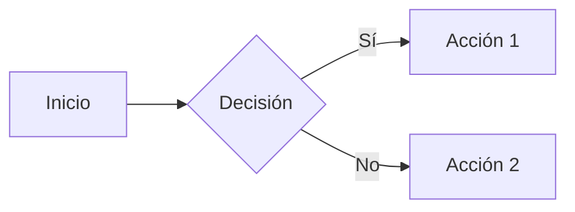

# AGENTS.md — Agentify SDD

## Descripción del Proyecto

Agentify SDD es un marco de orquestación de agentes de IA que implementa Spec-Driven Development (SDD). Consiste en skills (archivos Markdown) que guían fases: explorar, proponer, especificar, diseñar, implementar, verificar y archivar. Es un **meta-proyecto** de Markdown y scripts Bash/PowerShell.

---

## Comandos Disponibles

### Instalación

```bash
# Unix/Linux/macOS
bash scripts/install.sh

# Windows
powershell .\scripts\install.ps1
```

### Tests de Instalación

```bash
bash scripts/install_test.sh
```

### Verificación y Auditoría

```bash
# Auditoría estática contra specs
/sdd-review {nombre-del-cambio}

# Verificación automática de implementación
/sdd-verify {nombre-del-cambio}

# Reparación de estados corruptos
/sdd-fix
```

### Comandos SDD Principales

| Comando | Descripción |
|---------|-------------|
| `/sdd-init` | Inicializa contexto SDD |
| `/sdd-explore <tema>` | Investiga idea |
| `/sdd-new <nombre>` | Inicia nuevo cambio |
| `/sdd-continue` | Continúa fase pendiente |
| `/sdd-apply` | Implementa tareas |
| `/sdd-verify` | Valida contra specs |
| `/sdd-archive` | Archiva cambio completado |
| `/sdd-status` | Muestra estado de cambios |

---

## Convenciones de Estilo

### Regla de Idioma (CRÍTICA)

**TODO debe generarse en ESPAÑOL (CASTELLANO)**: propuestas, specs, diseños, código, comentarios, respuestas.

### Estructura de Archivos

```
skills/
├── _shared/                    # Convenciones compartidas
├── sdd-{fase}/                 # Skills por fase
│   └── SKILL.md
openspec/
├── config.yaml                 # Configuración
├── specs/                      # Specs actuales
└── changes/                    # Cambios activos
```

### Convenciones de Nomenclatura

| Elemento | Formato | Ejemplo |
|----------|---------|---------|
| Nombres de cambios | kebab-case | `mi-nuevo-cambio` |
| Archivos de skills | kebab-case | `sdd-apply/SKILL.md` |
| Carpetas de cambios | kebab-case | `openspec/changes/mi-cambio/` |

**Regex:** `^[a-z0-9]+(-[a-z0-9]+)*$`

### Formato de Specs (Given/When/Then)

```markdown
#### Escenario: Nombre del escenario
- GIVEN precondición necesaria
- WHEN acción realizada
- THEN resultado esperado
- AND resultado adicional
```

### Palabras Clave RFC 2119

| Palabra | Significado |
|---------|-------------|
| **MUST/SHALL** | Requisito obligatorio |
| **SHOULD** | Recomendado |
| **MAY** | Opcional |

### Diagramas

Usar diagramas **Mermaid** para flujos complejos:



### Reglas de Escritura

1. **Sin placeholders**: Escribir código completo, no usar `// código aquí...`
2. **Código defensivo**: Aplicar SOLID, DRY, Clean Code. Preferir Early Returns.
3. **Granularidad atómica**: Tareas implementables en un archivo/módulo.
4. **Modularidad extrema**: Diseñar para ventanas de contexto limitadas.

### State Machine (state.yaml)

**Nunca editar manualmente**:

```yaml
change: nombre-del-cambio
started_at: "2026-03-30T10:00:00"
last_updated: "2026-03-30T12:30:00"
current_phase: tasks
completed_phases:
  - explore
  - propose
  - spec
  - design
pending_phases:
  - tasks
  - apply
  - verify
  - archive
blocked: false
blocked_reason: null
```

### Recuperación de Estado

Tras pérdida de contexto:
1. Leer `openspec/changes/*/state.yaml`
2. Usar `current_phase` para identificar fase actual
3. Usar `completed_phases` para evitar repetir trabajo

### Integración con IDEs

- **.cursorrules** (raíz): Reglas Cursor para SDD
- **examples/cursor/.cursorrules**: Ejemplo configuración Cursor
- **examples/vscode/copilot-instructions.md**: Instrucciones VS Code Copilot

---

## Políticas de Calidad

### Límites de Contexto por Fase

| Fase | Límite |
|------|--------|
| sdd-propose | < 400 palabras |
| sdd-spec | < 650 palabras |
| sdd-design | < 800 palabras |
| sdd-tasks | < 530 palabras |

### Archivos Obligatorios por Fase

| Fase | Artefacto | Obligatorio |
|------|-----------|-------------|
| propose | proposal.md | Sí |
| spec | specs/{dominio}/spec.md | Sí |
| design | design.md | Sí |
| tasks | tasks.md | Sí |
| apply | tasks.md (actualizado) | Sí |
| verify | verify-report.md | Sí |

---

*Última actualización: 2026-03-30*
