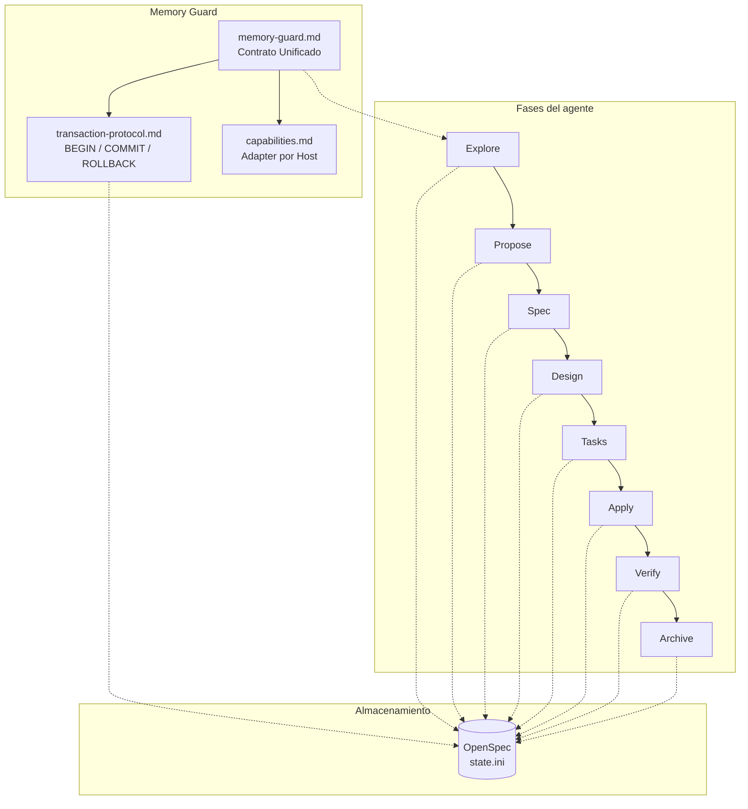

# State Guard
### Framework de Memoria Transaccional para Agentes LLM

State Guard es un framework de desarrollo de software para agentes de IA que estructura el trabajo en fases formales: explorar, proponer, especificar, diseñar, planificar, implementar, verificar y archivar. Su arquitectura de **Memory Guard** garantiza persistencia transaccional del estado entre sesiones, ejecución inline de fases con delegación inteligente, y optimización de tokens mediante inyección dinámica de contexto.

Para equipos que exigen rigor construyendo sobre lineamientos auditables.

---

## Instalación

### Unix / Linux / macOS

```bash
# Para modelos de entrada (OpenCode): realiza inlining para evitar pereza de herramientas
bash scripts/install.sh --target opencode

# Para modelos de frontera (Antigravity CLI): usa Context Streaming (lazy loading)
bash scripts/install.sh --target antigravity
```

Opciones para `--target`: `opencode` (por defecto), `antigravity`, `claude-code`.

---

## Comandos

| Comando | Descripción | Tipo |
|---------|-------------|------|
| `/init` | Inicializa el contexto del agente en el proyecto. Detecta el stack y crea la estructura `.state-guard/`. | Skill Directa |
| `/new <nombre>` | Inicia un nuevo cambio. Ejecuta exploración y propuesta como transacciones secuenciales inline. | Meta-Skill |
| `/continue` | Ejecuta la siguiente fase pendiente según `lock_phase` en `state.ini`. | Meta-Skill |
| `/ff` | Fast-forward de planificación: ejecuta propuesta → specs → diseño → tareas, cada fase como transacción independiente. | Meta-Skill |
| `/status` | Muestra el estado de todos los cambios activos, incluyendo estado transaccional. | Skill Directa |
| `/changelog` | Genera un changelog automático a partir de los cambios archivados. | Skill Directa |
| `/explore <tema>` | Investiga una idea antes de comprometerse. Lee el código base, compara enfoques e identifica riesgos. | Fase (Explore) |
| `/propose <nombre>` | Crea o itera sobre una propuesta de cambio de manera independiente. | Fase (Propose) |
| `/spec` | Escribe especificaciones delta para un cambio transaccional. | Fase (Spec) |
| `/design` | Crea el documento de diseño técnico para un cambio. | Fase (Design) |
| `/tasks` | Desglosa un cambio en tareas de implementación. | Fase (Tasks) |
| `/apply` | Implementa las tareas de un cambio. Escribe código siguiendo specs y diseño, marca tareas completadas. | Fase (Apply) |
| `/verify` | Valida la implementación contra las especificaciones. Ejecuta tests y genera reporte de cumplimiento. | Fase (Verify) |
| `/archive` | Cierra un cambio: fusiona las specs delta en las specs principales y mueve el cambio al archivo. | Fase (Archive) |
| `/split` | Divide proposals monolíticas en sub-cambios manejables. Útil para cambios demasiado grandes. | Skill Directa |
| `/review` | Realiza auditoría estática de código comparando contra las especificaciones. | Skill Directa |
| `/checkpoint` | Genera un resumen del estado actual de la sesión y lo guarda en `state.ini`. También se ejecuta automáticamente después de cada fase completada. | Skill Directa |
| `/rollback` | Purga la carpeta del cambio y restaura los archivos modificados desde git. | Skill Directa |
| `/skill-registry` | Escanea los directorios global (`$HOME/.skills-custom`) y local (`./skills-custom`) de skills y actualiza el repositorio local. | Skill Directa |

---

## Inicio Rápido

### 1. Inicializar el proyecto

```bash
/init
```

### 2. Crear un nuevo cambio

```bash
/new mi-nueva-funcionalidad
```

### 3. Continuar con las siguientes fases

```bash
/continue
```

El Memory Guard ejecutará la siguiente fase según `lock_phase`, persistiendo el estado transaccionalmente después de cada fase.

### 4. Implementar

```bash
/apply
```

### 5. Verificar

```bash
/verify
```

### 6. Git Commit (PASO OBLIGATORIO)

Antes de proceder al archivado, es **estrictamente obligatorio** guardar los cambios en el control de versiones. El comando `/archive` fallará si detecta cambios sin commitear.

```bash
git add .
git commit -m "feat: implementar mi-nueva-funcionalidad"
```

### 7. Archivar

Cierra el ciclo del cambio, fusionando especificaciones y moviendo los artefactos al histórico.

```bash
/archive
```

---

## Arquitectura



El **Memory Guard** es el contrato central que el agente carga al iniciar. Define cómo ejecutar fases (inline por defecto, delegadas solo cuando es necesario), cómo persistir estado (transacciones atómicas con BEGIN/COMMIT/ROLLBACK), y cómo recuperarse de pérdida de contexto.

**OpenSpec** guarda cada artefacto como archivo Markdown en el repositorio, permitiendo versionado y revisión en Pull Requests. El `state.ini` v2 incluye campos transaccionales que garantizan la integridad del DAG.

---

## Herramientas CLI Compatibles

State Guard es un framework **Agent-First**. El Memory Guard se adapta automáticamente a las capacidades de cada agente host:

| Herramienta | Ejecución Inline | Sub-agentes | Delegación Inteligente |
|-------------|:----------------:|:-----------:|:---------------------:|
| **Claude Code** | ✅ | ✅ | Delega apply pesados (> 10 tareas) |
| **OpenCode** | ✅ | ✅ | Delega apply pesados (> 10 tareas) |
| **Antigravity CLI** | ✅ | ✅ | Delega apply pesados (> 10 tareas) |

Todos los agentes ejecutan fases inline por defecto. La delegación a sub-agentes solo ocurre cuando la fase `apply` tiene más de 10 tareas pendientes y el host soporta sub-agentes reales.

---

## Conceptos Clave

### Memory Guard (Memoria Transaccional)

El Memory Guard reemplaza al modelo de "despachador de comandos CLI". En lugar de despachar cada fase a un sub-proceso con contexto fresco, el agente ejecuta las fases directamente (inline) protegido por un protocolo de persistencia transaccional:

- **BEGIN**: Marca la transacción como `in_progress` en `state.ini` antes de ejecutar la fase.
- **COMMIT**: Actualiza `current_phase`, `lock_phase`, `completed_phases` y `pending_phases` atómicamente después de completar la fase.
- **ROLLBACK**: Si la fase falla, restaura `txn_status: failed` sin modificar el progreso.

Este protocolo garantiza que el estado sobreviva a cualquier pérdida de contexto (crash, compactación, recarga de sesión).

### Specs Delta

Los cambios describen qué es diferente del estado actual, no reescriben todo. Al archivar, estos deltas se fusionan automáticamente en `.state-guard/specs/`.

### State Machine Transaccional

El archivo `state.ini` (v2) rastrea el estado de cada cambio con campos transaccionales (`txn_status`, `txn_phase`, `txn_started_at`) que permiten recovery automático de transacciones incompletas.

### Skills como Código

Cada skill es un archivo Markdown puro que cualquier agente de IA puede ejecutar inline. Sin dependencias externas. El Memory Guard carga cada skill en el momento exacto de uso, optimizando el consumo de tokens.

### Anti-Batching por Transacción

El protocolo de transacción **es** el mecanismo de anti-batching. Cada fase requiere su propio ciclo BEGIN → COMMIT. No es posible ejecutar múltiples fases en una sola transacción, lo que protege la integridad del DAG sin depender de reglas verbales.

### Inyección Dinámica de Contexto

El Memory Guard implementa inyección dinámica de contexto: cada skill recibe únicamente las rutas a los artefactos que necesita para su fase. Esto reduce significativamente el consumo de tokens y mejora la velocidad de procesamiento.

### Persistencia de Artefactos (OpenSpec)

El sistema utiliza **OpenSpec** como estándar de persistencia nativa:

- Los artefactos se almacenan como archivos Markdown en el repositorio
- Permite versionado y revisión en Pull Requests
- Carpeta de archivo: `.state-guard/changes/archive/YYYY-MM-DD-{change-name}/`

---

## Documentación Adicional

- [MANUAL.md](MANUAL.md) — Guía técnica: arquitectura Memory Guard, state.ini, configuración y flujos avanzados.

---

## Licencia

MIT
