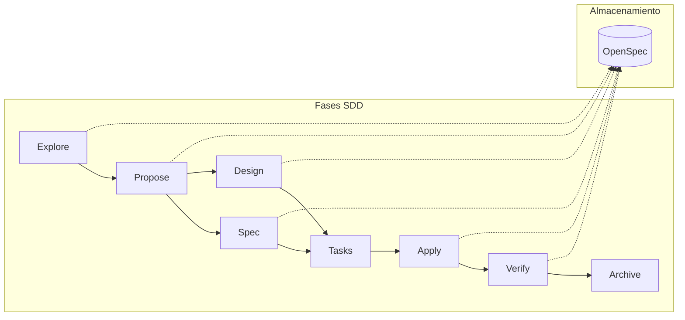

# Agentify SDD — Orquestador de Desarrollo Guiado por Especificaciones

Agentify SDD es un marco de orquestación de agentes de IA que estructura el desarrollo de software en fases definidas: explorar, proponer, especificar, diseñar, planificar, implementar, verificar y archivar. Para equipos que necesitan código auditable, mantenible y construido sobre especificaciones claras.

---

## Instalación

### Unix / Linux / macOS

```bash
bash scripts/install.sh
```

### Windows

```powershell
powershell .\scripts\install.ps1
```

---

## Comandos

| Comando | Descripción |
|---------|-------------|
| `/sdd-init` | Inicializa el contexto SDD en el proyecto. Detecta el stack y crea la estructura `openspec/`. |
| `/sdd-explore <tema>` | Investiga una idea antes de comprometerse. Lee el código base, compara enfoques e identifica riesgos. |
| `/sdd-new <nombre>` | Inicia un nuevo cambio. Delega exploración y propuesta a sub-agentes especializados. |
| `/sdd-continue` | Ejecuta la siguiente fase pendiente en el grafo de dependencias. |
| `/sdd-ff` | Fast-forward de planificación: ejecuta propuesta → specs → diseño → tareas sin intervención. |
| `/sdd-apply` | Implementa las tareas de un cambio. Escribe código siguiendo specs y diseño, marca tareas completadas. |
| `/sdd-verify` | Valida la implementación contra las especificaciones. Ejecuta tests y genera reporte de cumplimiento. |
| `/sdd-archive` | Cierra un cambio: fusiona las specs delta en las specs principales y mueve el cambio al archivo. |
| `/sdd-status` | Muestra el estado de todos los cambios activos mediante tabla con indicadores visuales. |
| `/sdd-split` | Divide proposals monolíticas en sub-cambios manejables. Útil para cambios demasiado grandes. |
| `/sdd-review` | Realiza auditoría estática de código comparando contra las especificaciones. |
| `/sdd-spec` | Escribe especificaciones delta para un cambio SDD. |
| `/sdd-design` | Crea el documento de diseño técnico para un cambio. |
| `/sdd-tasks` | Desglosa un cambio en tareas de implementación. |
| `/sdd-changelog` | Genera un changelog automático a partir de los cambios archivados. |

---

## Inicio Rápido

### 1. Inicializar el proyecto

```bash
/sdd-init
```

### 2. Crear un nuevo cambio

```bash
/sdd-new mi-nueva-funcionalidad
```

### 3. Continuar con las siguientes fases

```bash
/sdd-continue
```

El orquestador ejecutará cada fase secuencialmente, mostrando resúmenes y solicitando aprobación entre fases.

### 4. Implementar

```bash
/sdd-apply
```

### 5. Verificar

```bash
/sdd-verify
```

### 6. Archivar

```bash
/sdd-archive
```

---

## Arquitectura



**OpenSpec** guarda cada artefacto como archivo Markdown en el repositorio, permitiendo versionado y revisión en Pull Requests.

---

## Conceptos Clave

### Specs Delta

Los cambios describen qué es diferente del estado actual, no reescriben todo. Al archivar, estos deltas se fusionan automáticamente en `openspec/specs/`.

### State Machine ACID

El archivo `state.yaml` rastrea el estado de cada cambio, previniendo colisiones en trabajo concurrente.

### Skills como Código

Cada sub-agente es un archivo Markdown puro que cualquier asistente de IA puede ejecutar. Sin dependencias externas.

### Modo OpenSpec

El sistema utiliza **OpenSpec** como modo de persistencia:

- Los artefactos se almacenan como archivos Markdown en el repositorio
- Permite versionado y revisión en Pull Requests
- Carpeta de archivo: `openspec/changes/archive/YYYY-MM-DD-{change-name}/`

---

## Documentación Adicional

- [MANUAL.md](MANUAL.md) — Guía técnica: arquitectura DRY, State Machine ACID, configuración y flujos avanzados.

---

## Licencia

MIT
