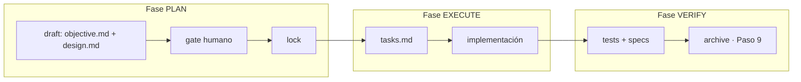

# State Guard
### Framework de Memoria Transaccional para Agentes LLM

State Guard mantiene el estado de un cambio de código sobreviviendo a pérdida de contexto, compactación o reinicio de sesión. Un agente que trabaja con State Guard nunca "olvida" en qué fase estaba ni qué falta hacer — el estado vive en disco, protegido transaccionalmente, no en el contexto de la conversación.

El trabajo se estructura en **3 fases con gate de aprobación humana obligatorio antes de escribir código**: `plan → execute → verify`.

---

## Instalación

### 1. Skills (uso diario — instalar esto primero)

```bash
bash scripts/install.sh
```

Instala los slash commands (`/init`, `/new`, `/continue`, etc.) en OpenCode y/o Antigravity CLI, detectando cuál de los dos tenés configurado. Esta es la forma principal de usar State Guard.

### 2. Servidor MCP (opcional — solo si usás un cliente MCP externo)

Si además querés que un cliente compatible con MCP (Claude Desktop, Cursor, etc.) pueda **consultar** el estado de un cambio sin pasar por las skills, instalá el servidor MCP. Ver "¿Skills o MCP?" más abajo para entender qué hace y qué no hace.

**Opción A — zero-install con `uvx` (recomendada):**
```json
{
  "mcpServers": {
    "state-guard": {
      "command": "uvx",
      "args": ["git+https://github.com/fdomerlo/state-guard.git"]
    }
  }
}
```

**Opción B — instalación local aislada:**
```bash
git clone https://github.com/fdomerlo/state-guard.git ~/.local/share/mcp-servers/state-guard
cd ~/.local/share/mcp-servers/state-guard
uv venv && uv pip install -e .
```
```json
{
  "mcpServers": {
    "state-guard": {
      "command": "/ruta/a/tu/home/.local/share/mcp-servers/state-guard/.venv/bin/state-guard-mcp"
    }
  }
}
```

### 3. Agent Hooks (opcional — automatización de tareas derivadas)

```bash
pip install -e '.[hooks]'
```

Instala la dependencia `watchdog` necesaria para el daemon de observación de filesystem. Ver sección "Agent Hooks" abajo.

---

## ¿Skills o MCP? — no es una decisión, son dos capas distintas

**Las skills son el mecanismo principal.** Corren el DAG completo: generan `objective.md`/`design.md`, esperan tu aprobación humana, desglosan tareas, implementan, verifican y archivan. Todo el control transaccional (`begin`, `commit`, `plan-approve`) vive acá.

**El servidor MCP es un complemento de solo lectura.** Expone 3 herramientas (`get_next_task`, `verify_phase_gate`, `mark_task_completed`) para que un cliente MCP externo pueda consultar o marcar progreso **sin** disparar el flujo completo de fases. Deliberadamente **no** expone `begin`/`commit`/`plan-approve` — ningún cliente MCP puede aprobar un plan ni forzar una transición de fase. Eso solo pasa por tu terminal.

Si solo trabajás desde OpenCode o Antigravity CLI, no necesitás el servidor MCP para nada — las skills alcanzan.

---

## Comandos (skills instaladas)

| Comando | Qué hace |
|---|---|
| `/init` | Detecta el stack del proyecto y crea la estructura `.state-guard/`. Correr una sola vez por repo. |
| `/new <nombre>` | Inicia un cambio nuevo. Arranca la fase `plan` (draft → gate humano → lock). |
| `/continue` | Ejecuta la siguiente fase pendiente según `lock_phase` en `state.ini`. Es el comando que usás una y otra vez para avanzar. |
| `/ff` | Fast-forward: corre planificación de punta a punta sin pausas intermedias (el gate humano de `plan` sigue siendo obligatorio). |
| `/status` | Estado de todos los cambios activos, incluyendo estado transaccional. |
| `/split` | Divide un cambio demasiado grande en sub-cambios manejables. |
| `/review` | Auditoría estática: compara el código contra las specs. |
| `/checkpoint` | Guarda un resumen de la sesión actual en `state.ini`. También corre automáticamente después de cada fase. |
| `/rollback` | Purga la carpeta del cambio activo y restaura los archivos modificados desde git. |
| `/changelog` | Genera un changelog a partir de los cambios ya archivados. |
| `/skill-registry` | Reindexa skills custom en `$HOME/.skills-custom` y `./skills-custom`. |

No hay comandos separados para diseño, tareas, implementación o archivado — `/continue` decide automáticamente qué corresponde según en qué fase estás.

---

## Inicio Rápido

```bash
# Una vez por repo
/init

# Por cada cambio
/new agregar-autenticacion-oauth
```

Esto genera `objective.md` y `design.md` en `.state-guard/changes/agregar-autenticacion-oauth/`, valida su estructura (`sg validate-spec`), y te deja un bloque de texto con instrucciones para aprobar el gate **desde tu propia terminal**, no desde el chat con el agente:

```bash
sg plan-approve --change agregar-autenticacion-oauth
# El código de confirmación aparece SOLO en tu terminal (/dev/tty), nunca en la
# conversación con el agente. Con ese código, en la misma terminal o en otra:
sg plan-confirm --change agregar-autenticacion-oauth --token <CÓDIGO>
```

Una vez confirmado, seguís avanzando con el mismo comando las veces que haga falta:

```bash
/continue   # ejecuta EXECUTE: genera tasks.md e implementa
/continue   # ejecuta VERIFY: corre tests, y si aprueba, archiva automáticamente (Paso 9)
```

**Git commit es obligatorio antes de que VERIFY pueda archivar** — si hay cambios sin commitear, el archivado falla.

```bash
git add .
git commit -m "feat: agregar autenticación OAuth"
```

### Bypass de emergencia (hotfix)

Para saltar la fase `plan` en una regresión crítica de producción, sin saltarte el gate humano — el bypass queda registrado con motivo en `state.ini`:

```bash
sg hotfix-init --change fix-login-roto --reason "regresión crítica en prod, login caído"
# código mostrado en tu terminal, igual que plan-approve
sg hotfix-confirm --change fix-login-roto --token <CÓDIGO>
```

---

## Arquitectura



- **`plan`**: produce `objective.md` (qué y por qué) + `design.md` (cómo, arquitectura, flujo de datos). Antes de pedir aprobación humana, `sg validate-spec` chequea estructuralmente que ambos artefactos estén completos (secciones presentes, sin placeholders sin completar, sin preguntas bloqueantes `[!]` sin resolver). El lock que habilita `execute` **solo** lo puede emitir un humano confirmando `sg plan-confirm` desde su propia terminal — el agente no puede auto-aprobarse.
- **`execute`**: genera `tasks.md` e implementa.
- **`verify`**: corre tests contra las specs y, si aprueba, archiva el cambio automáticamente (no es una fase separada, es el Paso 9 del veredicto de `verify`).

Todo el estado transaccional vive en `.state-guard/changes/{nombre}/state.ini`, con ciclo `BEGIN → COMMIT/ROLLBACK` — nunca se edita a mano.

---

## Agent Hooks

Automatización en background para tareas **derivadas** de un cambio ya aprobado — nunca para decisiones de arquitectura.

| Acción | Quién la dispara | Gate humano |
|---|---|---|
| Aprobar `objective.md`/`design.md` | Solo vos, desde tu terminal | Sí, siempre |
| Actualizar tests / sincronizar docs / marcar tareas | Hook automático | No |

```bash
cp .state-guard/hooks.yaml.example .state-guard/hooks.yaml
# editar reglas: qué patrón de archivo dispara qué prompt
sg hooks-start
sg hooks-status
sg hooks-stop
```

El daemon nunca toca `objective.md` ni `design.md`, sin excepción — esa restricción está en el código del daemon, no en `hooks.yaml`, así que no se puede desactivar por configuración. Cada disparo queda registrado en `.state-guard/hooks.log.jsonl` para auditoría.

Ver `MANUAL.md` para el detalle completo de configuración.

---

## Documentación Adicional

- [MANUAL.md](MANUAL.md) — arquitectura técnica, `state.ini`, `sg.py`, gate humano, MCP, Agent Hooks, resolución de problemas.
- [MIGRATION_PLAN.md](MIGRATION_PLAN.md) — historial de la consolidación y evolución del proyecto.

---

## Licencia

MIT
