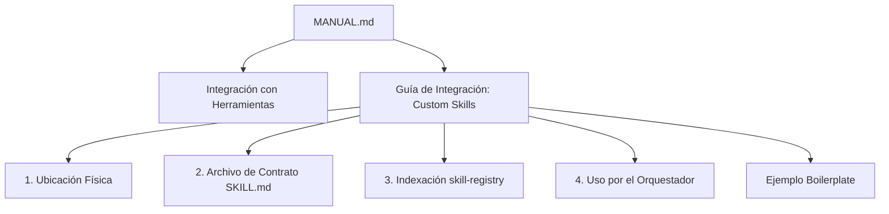

# Diseño Técnico: Implementación de la Guía de Custom Skills

## Arquitectura del Cambio
El cambio involucra exclusivamente documentación técnica en el repositorio principal del framework SDD, específicamente editando el archivo `MANUAL.md`.

## Ubicación del Contenido
La nueva subsección "Guía de Integración: Custom Skills" se insertará en el archivo `MANUAL.md` justo antes de la sección "Resolución de Problemas", o como una sub-sección de "Integración con Herramientas", para mantener la coherencia semántica del documento.

## Detalles de Implementación Documental

### Ejemplo Boilerplate de SKILL.md
El boilerplate de `frontend-design` debe simular cómo el agente interpreta el perfil no-SDD, mostrando cómo registrar metadatos y ofrecer instrucciones al LLM (usaremos YAML frontmatter y Markdown según el estándar de `SKILL.md` del ecosistema Agentify SDD).

### Tono y Estilo
- Ajustarse a las convenciones de Markdown del proyecto (`##` y `###` para el anidamiento).
- Cumplir la regla de idioma español estricto.
- Usar bloques de código para comandos CLI o nombres de archivos. No sobre-ingeniar la documentación.

## Estrategia de Testing / Verificación
Dado que es un cambio de documentación puro, la verificación consistirá en una revisión estática garantizando que todos los puntos del req (REQ-01 a REQ-07) estén presentes en `MANUAL.md`.
